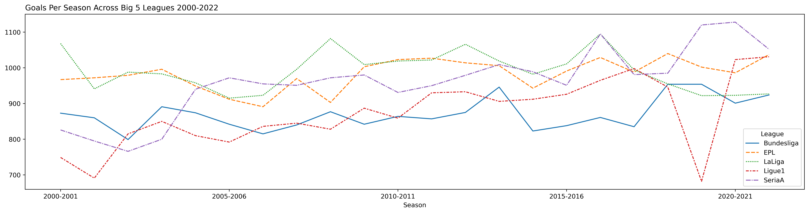
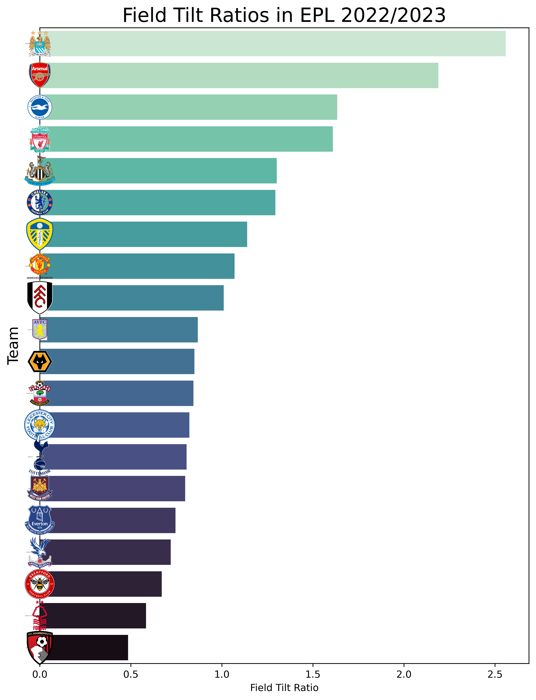

Hi! My name is Tejas and I'm a junior at NYU majoring in Data Science with a minor in Math and CS. I'm fascinated by the power of data and its potential to drive innovation across all disciplines. However, the two particular domains that I am currently most interested are sports and medicine.

I believe that data science in sports can help teams make better decisions, improve player performance, and ultimately increase their chances of success. 
Likewise, with the abundance of data in healthcare, there is a tremendous opportunity to use data science to identify patterns, predict outcomes, and improve patient care. My aim is to use data science and mathematics for insight. 

This is just an archive of my data science and machine learning projects. 

## notebooks
[Random Forest XGB Catboost Ensemble on Kidney Stone Dataset](https://github.com/s1imreaper/vault/blob/main/random-forest-xgb-catboost-ensemble-t40.ipynb)  Random Forest XGB Catboost Ensemble for Kaggle Playground Competition. Placed (427/1088).   

[The Best Attackers of the 2000s (Simple EDA)](https://github.com/s1imreaper/vault/blob/main/the-best-attackers-of-the-2000s%20(1).ipynb) 
Simple Analysis of FBref x Opta Data over last 23 Years.   
[Olist Brazil EDA and Market Channel Analysis](https://github.com/s1imreaper/datasci/blob/019930029e0016651032afbd8cdbefb7d28005ce/eda-and-rough-sentiment-analysis.ipynb)   
Broad EDA on shipping, reviews, price, customers, etc. Detailed analysis of marketing channels and conversion rates. Sentiment Analysis on reviews and slight analysis on conversion rates and marketing channels. Word plots grouped by sentiment in Portuguese.   
[UCI Machine Learning "What Makes a Good Student?"](https://github.com/s1imreaper/datasci/blob/777d4177366e874329acf19a55adeb957ade3661/what-makes-a-good-student-eda.ipynb)   
EDA and Visualizations on UCI Test Scores and Alcohol Consumption Dataset. 
Linear Regression, SVM, NaiveBayes to predict test scores and alcohol consumption by students. Model predicts final exam scores with 92% accuracy using first two exam scores, parents education levels, and study time.    

[InceptionV3 Intel Classification](https://github.com/s1imreaper/datasci/blob/c7a8b4877c8df4d172f138475404dd3c221c54c8/inceptionv3-88-classification.ipynb)  
Intel Computer Vision classification using deep neural networks and InceptionV3. 90% on test data. Additional validation from non-dataset images.   
[Spotify x Youtube EDA + Artist Classification Model](https://github.com/s1imreaper/datasci/blob/b48786d8e94dc1d183cd074eb5a63549f305f55c/spotify-yt-top-songs-eda-artist-classification.ipynb) 
Spotify and Youtube top songs EDA and artist classification model.   
[Premier League Viz](https://github.com/s1imreaper/datasci/blob/b48786d8e94dc1d183cd074eb5a63549f305f55c/premier-league-visualizations%20(1).ipynb) 
FieldTilt, xG, xGA, and visualization of other premier league advanced statistics. Some use of NLP in scraping commentary transcripts and Feature Engineering. Histograms, Scatterplots, and other simple visualizations with advanced metrics.    
[NaiveBayes on Heart Attack Likelihood and EDA](https://github.com/s1imreaper/datasci/blob/b48786d8e94dc1d183cd074eb5a63549f305f55c/simple-eda-on-heartattack-dataset.ipynb) 
EDA and Classification on Heart Attack Dataset. 
Employment of DecisionTrees, LassoRegression, GaussianNB for prediction. 77% score on prediction of heart attack using resting ecg, maximum heart rate of patients, and anginal pain type.    

